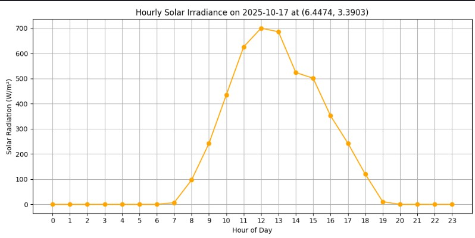

# Solar Irradiance Visualizer

Plots hourly solar irradiance for a given location using the Open-Meteo API.  
This simple Python script fetches solar radiation data for the current day and visualizes it in a clear graph.

## Example Output



## Features

- Fetches hourly solar radiation (W/m²) for any location.
- Visualizes sunlight intensity across the day.
- Easy to run and understand.
- Requires no API key.

## Requirements

- Python 3.x
- Libraries: `requests`, `matplotlib`

Install dependencies with:

```bash
pip install matplotlib requests
